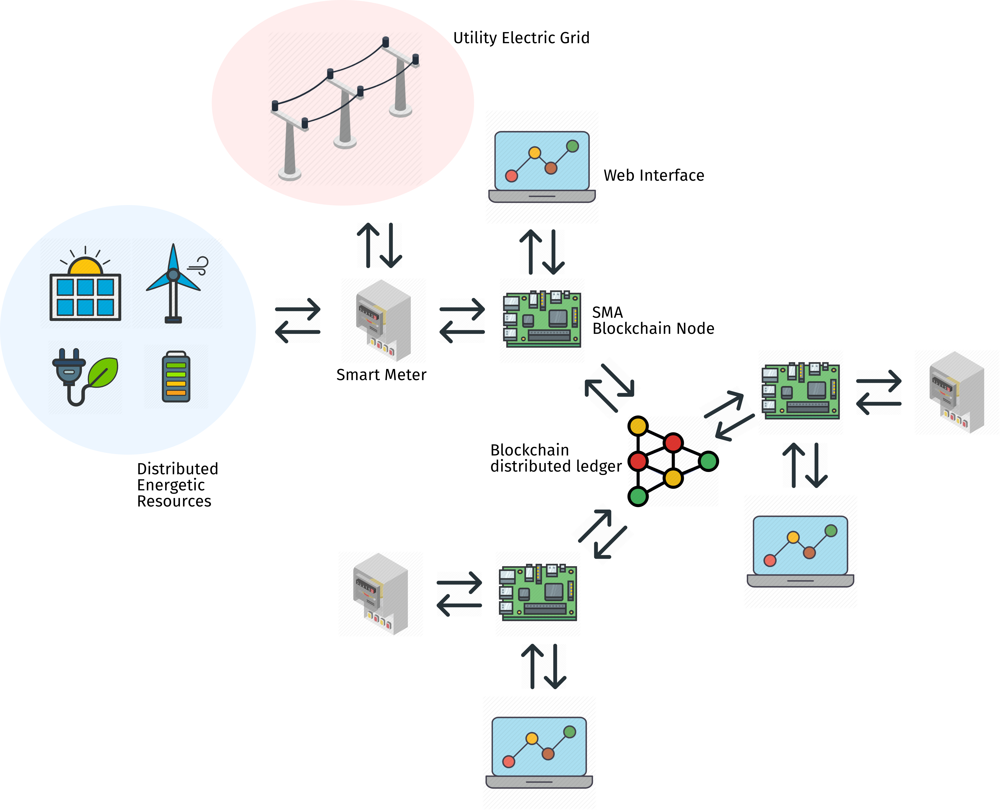

# Projeto de Pesquisa e Desenvolvimento: Blockchain Aplicado a Medidores Elétricos Inteligentes

<!-- 

    

 -->

    

## Um pouco de História

A história do blockchain está diretamente ligada à história da mais facmosa criptomoeda, o *bitcoin*, que foi lançada em 2009 pelo misterioso **Satochi Nakamoto** que até hoje não teve sua identidade descoberta.

O bitcoin, ao contrária das moedas tradicionais, não é controlada por uma entidade central, ou seja, um banco central e sim *minerada* por computadores espalhados pelo mundo em uma rede do tipo ponto-a-ponto (p2p), o mesmo tipo de arquitetura por trás dos famosos Torrents.

    

E, o mais importante, o bitcoin está baseado na utilização do blockchain, que, de forma bastante simplificada é:

> Um *Shared Ledger*, ou livro de registros compartilhados, em que, uma vez inserido um registro, este se torna imutável. 

A arquitetura do blockchain permite aos participantes a abilidade de compartilhar o livro de registros, que é atualizado por meio de uma replicação ponto-a-ponto, toda vez que uma nova transação acontece.

Por atualização ponto-a-ponto, significa que cada nó da rede atua tanto como um editor, quanto como um assinante. Cada nó pode receber ou enviar transações para outros nós e esses dados são sincronizados por toda a rede, a medida que são propagados. Dessa forma, o blockchain atua por meio de um modelo de consenso distribuído.

    

Com tudo isso, a adoção do blockchain em diferentes setores pode significar:

- Economia de tempo: de dias, para transações quase instantâneas;
- Redução de custos: eliminação de custos operacionais e de intermediários;
- Redução de riscos: mitigação de fraudes, adulterações e outros crimes cibernéticos;
- Aumento da confiança: processos e registros compartilhados com segurança. 

    

## Aplicações do Blockchain

    

## Iniciativas no setor elétrico

Notícias

- [Empresas do setor de energia investem 300 milhões de dólares em 2017 para aplicações em blockchain](https://www.ccn.com/energy-sector-invests-300-million-in-blockchain-in-past-year/)

Relatórios

- [Principais iniciativas de blockchain para setor elétrico são voltadas para compra e venda de energia](https://www.blockchain2business.eu/blockchain-content/guide-companies-blockchain-energy)

Iniciativas Mundialmente Conhecidas

- [Energy Web](https://energyweb.org/)

- [Power Ledger](https://www.powerledger.io/)

- [Solar Coin](https://solarcoin.org/)

## Potenciais aplicações no setor elétrico

- Controle de fluxo e armazenamento de energia no ambiente de integração de energia renovável;
- Monitoramento e gestão de ativos da rede;
- Levantamento de fundos para energia renovável e respectiva remuneração dos participantes via emissão de tokens;
- Uso de criptomoedas para pagamento de fornecimento de energia;
- Emissão de certificados de energia renovável com garantia de origem;
- Sistema de billing e segurança para estrutura de recarga de veículos elétricos e **smart meters** (inclusive medidores pré-pagos);
- **Compra e venda de energia descentralizada**:
    - No atacado;
    - No mercado de pequenas gerações distribuídas.

### Conclusões Preliminares 

- O uso da tecnologia blockchain no setor elétrico tem crescido exponencialmente nos últimos dois anos, assim com a quantidade de interessados, incluindo as grandes empresas de energia;

- A maior parte das aplicações estão concentradas nos novos mercados como: geração distribuída, recarga de veículos elétricos e emissão certificados.

## Proposta para P&D UFC - Eletra energy

Integração dos **medidores inteligentes** à **placas de desenvolvimento** contendo **sistemas multiagentes** capazes de realizar:

- leitura de dados dos medidores;
- enviar sinais de comando para acionamento de cargas, geradores, e/ou dispositivos de armazeamento de energia.
- Integrar-se a um sistema de blockchain já consolidado, utilizando smart-contracts, para efetivar transações de compra e venda de energia.

Além disso o projeto ainda contemplaria uma interface web para visualização e configuração dos dispositivos comercializadores.

    

 

### Placa de Desenvolvimento

Desenvolvimento de componente de software capaz de realizar leitura dos dados coletados pelo medidor inteligente. Desenvolvimento de nó comunicante conectado ao blockchain e de smart-contracts para compra e venda de energia. Necessário aquisição das placas e de sistema de infraestrutura de rede.

 

### Blockchain

Busca da plataforma e das tecnologias que se adequem bem aos objetivos do projeto. Averiguação entre as principais tecnologias existentes e obtenção do conhecimento necessário à implementação dos smart-contracts de compra e venda de energia. Necessário aquisição de recursos computacionais em numvem e/ou em plataformas de blockchain.

 

### Smart Meter

Estudo dos protocolos necessários para a realização de comunicação bi-direcional entre medidor e aplicação de gerenciamento de compra/venda. Necessário aquisição de medidores inteligentes comerciais. 

 

### Web Interface

Desenvolvimento de servidor web para exibição de dados e configuração do dispositivo. Necessário aquisição de recursos computacionais em nuvem.

  

### Recursos energéticos distribuídos

Estudo do gerenciamento de recursos energéticos distribuídos integrados via rede de dados com possibilidade de controle e acionamento remoto com objetivo de minimização dos custos. Para estudos mais específicos, se faz necessário aquisição de sistema de simulação Hardware-in-the-loop (HIL).

 

## Estrutura do projeto

- 3 Professores Pesquisadores (12 horas semanais);
- 1 bolsista de doutorado (12 horas semanais);
- 3 Bolsistas de IC (20 horas semanais).

## Metodologia para gerenciamento do projeto

Aplicação da metodologia de desenvolvimento ágil **Scrum** com sprints de 15 dias.
 
 - Definição do Product Owner;
 - Definição do Scrum Master;
 - Definição e treinamento da Equipe;
 - Elaboração do Product Backlog;
 - Classificação das tarefas.

### Tarefas do projeto

- Revisão bibliográfica a respeito de blockchain e suas tecnologias;
- Revisão bibliográfica a respeito de gerenciamento de recursos energéticos distribuídos;
- Estudo do medidor a ser utilizado e de suas funcionalidades;
- Estudo dos protocolos de comunicação utilizados pelo medidor;
- Montagem de bancada de testes com infraestrutura de comunicação em rede;
- Estudo de plataformas de simulação utilizando HIL;
- Estudo e seleção de plataformas de computação em nuvem;
- Estudo das tecnologias de implementação (Python e seus frameworks);
- Desenvolvimento de nó comunicante com blockchain;
- Implementação inicial dos smart-contracts;
- Integração de smart-contracts com sistemas multiagentes;
- Implementação inical da lógica para gerenciamento de recursos energéticos distribuídos;
- Implementação inicial de sistema web para visualização de dados e configuração de ajustes.

<!-- ### Planejamento das Sprints -->